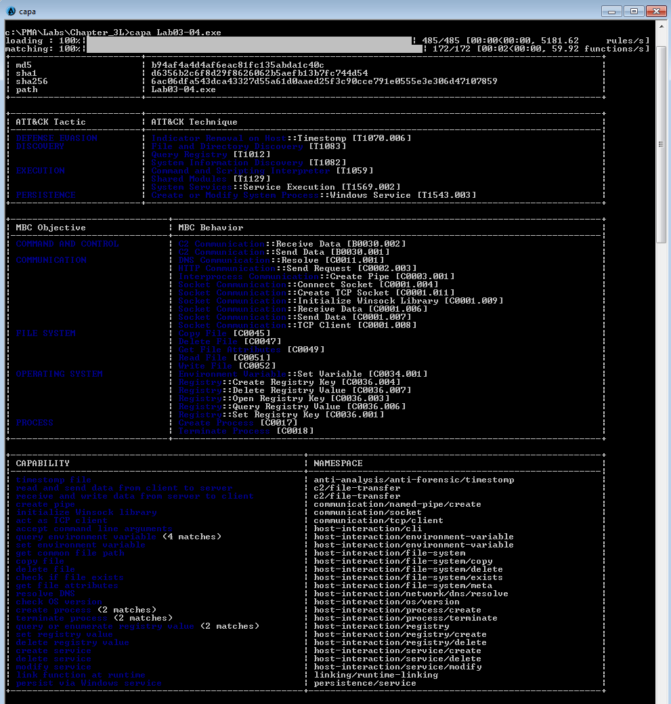

# Lab 3-4

## Analyze the malware found in the file *Lab03-04.exe* using basic dynamic analysis tools

### Questions

1. What happens when you run this file?
2. What is causing the roadblock in dynamic analysis?
3. Are there other ways to run this program?

### Answers

1. Initial run suggests the file executes and deletes itself from disk.
2. Either some sort of valid input to execute the malware. Possibly a command line argument, loader, a specific file on disk, or network access.
3. Strings inside the sample suggest command line arguments, but using these arguments in strings did not alter the execution.

CAPA reveals some interesting information; however, a deeper analysis would be necessary to know more about what is going on.

**Note: I am not going deeper here, because this sample is covered again in a later lab.**
