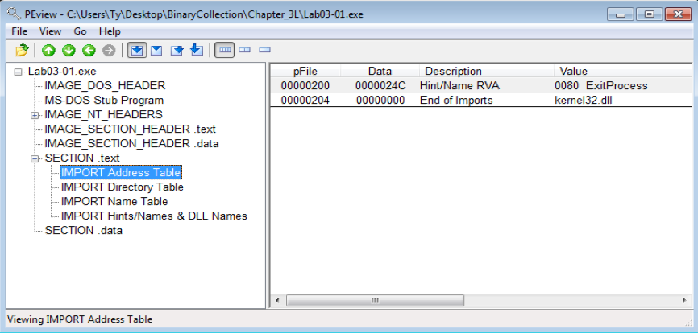
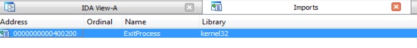
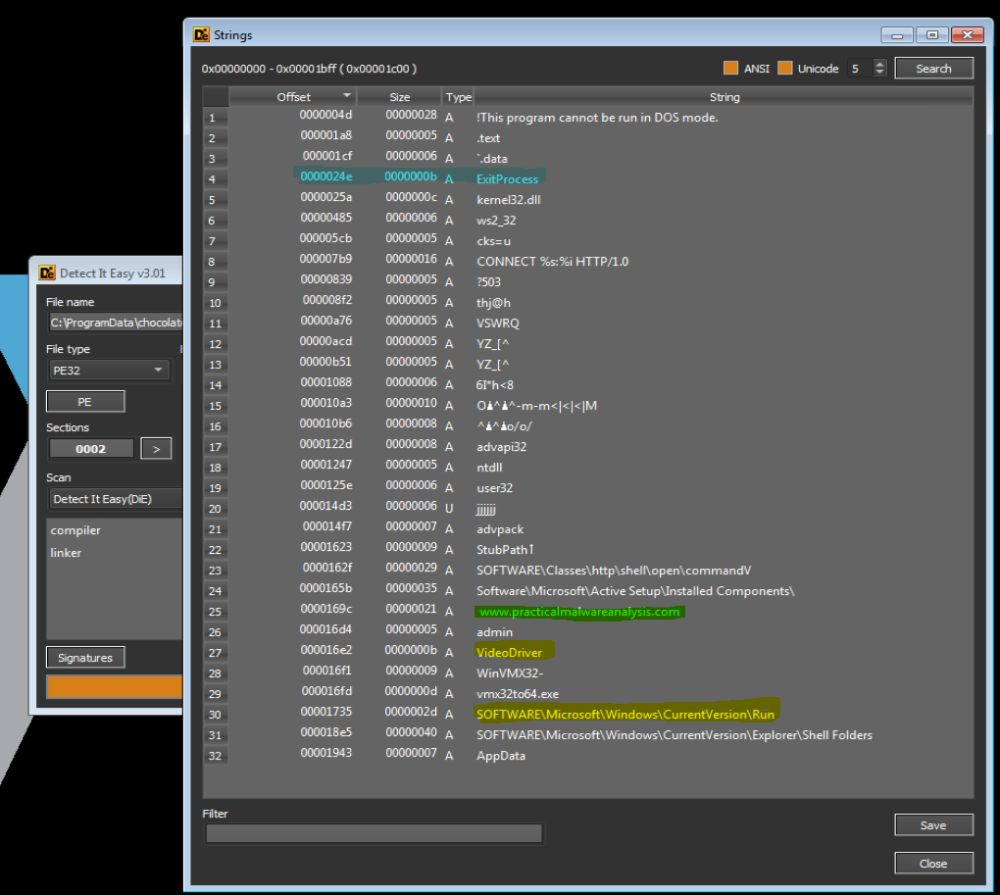
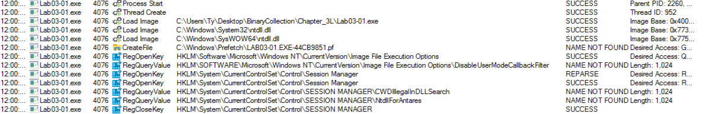
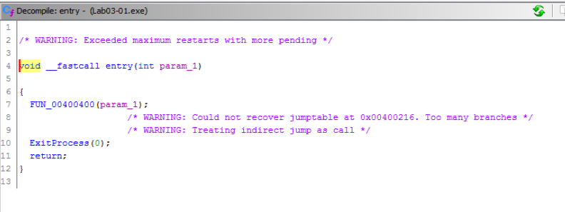

# Lab 3-1 (Unfortunately Broken)

### Analyze the malware found in the *Lab03-1.exe* using basic dynamic analysis tools.

### Questions:
    1. What are this malware's imports and strings?
    2. What are the malware's host-based indicators?
    3. Are there any useful network-based signatures for this malware? If so, what are they? 

### Answers:

Opening **Lab03-1.exe** with **PEView** checking for imports I saw only **ExitProcess** from kernel32.dll. Checking in IDA was just a confirmation.

Now on to the strings:

Using **Detect It Easy (v3.01)** and going to the strings tab there was a URL shown (more on this later) as well as the ExitProcess as seen before. I also noticed some junk strings, although it's not uncommon to see this. What I did find interesting was the Registry Key of: *SOFTWARE\Microsoft\CurrentVersion\Run* which means persistence.

Unfortunately, trying to run this executable in Win 7 caused it to fail. Why? Well, it looks like **UAC** causes it to fail. Even if I turn off UAC or set the compatibility mode to WinXP SP3, UAC will immediately jump in and deny the execution. UAC was created in 2007 with Windows Vista as a means to isolate the OS and Users from potential dangers, like Malware (**Would You Like To Know More?** https://learn.microsoft.com/en-us/windows/security/identity-protection/user-account-control/how-user-account-control-works). **Process Monitor** and **Process Explorer** show the .exe creating the **Lab03-01.exe** but it fails as seen in the image above.

Now with the URL: Had this worked, I would have expected the malware to ping out to *www.practicalmalwareanalysis.com* and would have been looking for in either in a **Wireshark or CAPA** capture. I went to dig in deeper; however, pulling up **Ghidra** to decompile and RE the malware was unsuccessful.

### *Womp womp...* UAC for the fail...