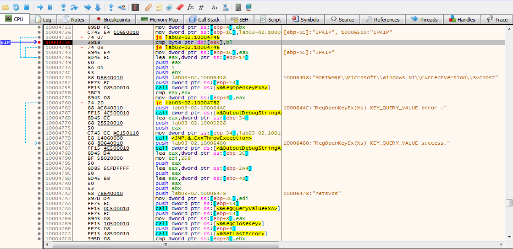

# Lab 3-2 (Unfortunately, Also Broken)

Contents: [Problem](#problem) | [Reversing to Better Understand](#reversing-to-better-understand) | [Making It Work](#making-it-work) | [Summary](#summary)

## Problem

### Analyze the malware found in the file *Lab03-02.dll* using basic dynamic analysis tools.

#### Questions:
    1. How can you get this malware to install itself?
    2. How would you get this malware to run after installation?
    3. How can you find the process under which this malware is running?
    4. Which filter could you set in order to use procmon to glean information?
    5. What are the malware's host-based indicators?
    6. Are there any useful network-based signatures for this malware?

#### Answers:
*Usually before I run anything, I like to poke a bit to see roughly what I can expect to see being run. It just helps me scope my expectations versus outcomes.*

Looking at the **Lab03-02.dll** I see that the export functions are **Install, installA, UninstalService, uninstallA, and ServiceMain**. So I would need to run a CMDline console and call *rundll32.exe* and then call the exported DLL function. I'm going to run this CMD console as Admin just in case. I'll have Procmon open and filtering on **ProcessName = rundll32.exe** just in case (it's noisy but a 30 second capture will suffice).

Unfortunately, the DLL failed to install and execute. Why? Well let's look at Procmon.

I see a lot of *NAME NOT FOUND* and *FILE LOCKED WITH ONLY READERS*. Beyond that I am a bit clueless and a quick search has turned up nothing substanial. Let's try something else.

Okay since the *Install* function did not work, let's try *installA* (I thought **InstallA == installA** in CMD Line, but I guess not hence the retry). Again, it was a fail, so back to the Procmon capture.

Again, see see the same thing of *NAME NOT FOUND* and *FILE LOCKED WITH ONLY READERS*, but that's about it. So, let's do a look with Ghidra/IDA and see what this malware should have done.

In IDA, I clicked on the *Install* export function and was immediately sent to this function. It is interesting that I see **Svchost** (aka Services). Note, **ServiceMain**, **IPRIP**, and **netsvcs** means that the malware is creating a **network service** to conduct either beaconing and C&C.

So we have network requirement and looking at the strings I see interesting URLs. I'm suspecting the *serve.html* is a page we have to hit. I also see what looks like to be User-Agent strings in there with **HTTP/1.1** and **Windows XP 6.11**, but this is a guess.

Looking back at the Imports section shows some interesting calls with **WININET** and **WS2_32** (aka Windows Network DLLs). There are several Internet and HTTP calls as well as some useful information in the imports section with calls like ***gethostname***, ***_strnicp*** (it's above the screenshot crop), ***Sleep***, and ***WaitForSignleObject***. I also see an ***OutputDebugStringA*** which may be helpful in seeing where this DLL fails by using **DbgView** from SysInternals.

Going a little deeper into IDA I see this:

This is just looking at different approaches to fitting the puzzle piece in the correct spot. What I notice here is I see here that there is a registry entry and most likely in *HKLM\\\SYSTEM\\\CurrentControlSet\\\Services* and seeing earlier that *IPRIP* was being added as a service, I am assuming that there will be an *IPRIP* key in the registry. Well, there's not  at this moment because the DLL failed to load/execute. Also, being that it's Windows registry means that persistence is a part of this malware.

So we found out the indicators and signatures, both host and network. Unfortunately it did not run as expected. **Why?** My first guess is the DLL cannot find/create the registry keys it needs to create the service, so it fails hard. But based on what we found so far we have met the requirements for answering the lab questions. Technically, it is supposed to work  on XP (I'm using Win 7 x64 here) in order to answer the questions, but I am curious.

## Reversing to Better Understand

Just because the malware didn't execute doesn't mean just stop there. I personally see this as an opportunity to know more about how Windows Services are created, how they work, and find out what this malware really does. There is a lot more here than what meets the eye at first so let's dig a bit deeper. So let's first move on to Windows Services.

### About Services:
    
>Links: \
https://learn.microsoft.com/en-us/dotnet/framework/windows-services/introduction-to-windows-service-applications#service-lifetime \
https://learn.microsoft.com/en-us/windows/win32/services/debugging-a-service

I'm no expert on Windows Services, so this is a learning experience for me. I do know Windows Services group items together for security (e.g. Network, RPC, Interfaces, Diagnostics, etc.). Some additional information that was passed to me from a colleague who knows a lot more than I do (codename: Dnude... *it's an inside joke*):

> When using **sc** from the command line to start a serivce, you are interacting with the service control manager in **services.exe** from there advapi32.dll exports all the functionality for interacting with services. If a service is **WIN32_OWN_PROCESS**, it will launch the service (aka app.exe) as its own process.
If it is a **WIN32_SHARED_PROCESS**, then it needs to be hosted in a container as **svchost** and **svchost** can host either 32 or 64-bit binaries.

In this malware sample, from what I have obtained so far, is trying to create a Service Group by creating registry keys and run continuously and ultimately hide in plain sight.

### Live Debugging:

Using **x32dbg** (in Admin mode), I need to run the *Lab03-02.dll* with *rundll32.exe*. In order to do that I first need to set the settings for *x32dbg* to **Break on DLL Load** and that is under **Options > Preferences**. *A friend showed me how to do this and it is extremely helpful!*

Then under **File > Change Command Line** make the following edit:

`"C:\Windows\System32\rundll32.exe" C:\PMA\Labs\Chapter_3L\Lab03-02.dll, Install ` (*Note: Your location will be different... Also, we'll run into a [problem with this later](#64-bit-to-32-bit-envrionment-error)*.)

Now I can step through (F9) twice and break on the loading of *Lab03-02.dll*. Then remove **Break on: DLL Load** setting change, since we do not need to break on any other loaded DLLs. Also, take snapshots! Now that we have this in place, the next question is where does it break/fail? I don't intend to spend hours stepping through operations, so on to decomp with Ghidra.

Since the DLL will not install a good starting place is the Install export function which on initial decompilation shows *RegOpenKeyExA*, *OutputDebugStringA*, *RegQueryValueExA*, *CreateServiceA*, etc. We just need to clean up the decompiled code for better reading.

>Note: IDA Pro has some the ability to modify string literals with "const", Ghidra does too with "Set Equate..." \
https://www.sans.org/blog/a-few-ghidra-tips-for-ida-users-part-2-strings-and-parameters/ \
https://swarm.ptsecurity.com/ida-pro-tips/

With **Set Equate** and **Set Associated Label** in Ghidra, we can now turn this:

Into this:

This amount of reversing should be sufficient for now. Back to x32dbg, we can set a breakpoint on the address for the Install function and then step through the dissassembly while referring to the decompliled code in Ghidra/IDA.

We can find the Install function in the Symbol table of x32dbg because Install was an exported function in the DLL. The addresses between x32dbg and Ghidra/IDA should line up (in this case they did). Note: I made the mistake of using x64dbg at first, instead of x32dbg, and I had issues with hitting the Install function breakpoint. This sample is a 32-bit sample. So if you're not seeing the results you're expecting, try the other one.

Now we can see the similarities between the two applications and step through them live to see the actual return values or errors. Stepping though, I was able to see that we were able to open the *\\\SOFTWARE\\\Microsoft\\\Windows NT\\\CurrentVersion\\\Svchost* location in the registry. 

Next step through is to query *netsvcs*, which is in the registry, but now the malware is looking for a substring of data... mainly IPRIP. I am highlighting the parsing process on its second pass here for reference. Eventually, after stepping through each substring, the DLL was unable to find IPRIP, from there it will then drop out of its loop, display the output debug string, call the exception, and abort.

## Making It Work

So now that we know how it fails, let's make it succeed. We already have our breakpoints set from the past run and we know where it fails.

So let's take a snapshot and start making some manual edits to the registry starting with the **IPRIP** substring in the **Svchost** key, we'll add it to the top just to save time. Then we can step through and follow the path of execution from there. Which unfortunately I hit a small issue when doing this step through. Intially I made edits to the *\\\SOFTWARE\\\Microsoft\\\Windows NT\\\CurrentVersion\\\Svchost\\\netsvcs* registry key. You can [bypass this rabbit hole](#back-on-track) though.

## 64-bit to 32-bit Envrionment Error
 
However, when stepping through with x32dbg, I noticed that **IPRIP** was not populating in memory. So I did a registry search in **regedit** for **netsvcs** I found similar key at *\\\SOFTWARE\\\Wow6432Node\\\Microsoft\\\Windows NT\\\CurrentVersion\\\Svchost* the difference here is the Wow6432Node. *That hot "Windows on Windows (WoW)" action*. This threw me down the path of the whole working a 32-bit sample in a 64-bit envrionment. Long story short, these two registry key locations are not the same, so I added the **IPRIP** to the Wow6432Node version of netsvcs to see if **IPRIP** would populate in memory (*which it did*).

Another problem I had with debugging is I was using: `"C:\Windows\System32\rundll32.exe" C:\PMA\Labs\Chapter_3L\Lab03-02.dll, Install ` when I should have been using `"C:\Windows\SysWOW64\rundll32.exe" C:\PMA\Labs\Chapter_3L\Lab03-02.dll, Install `. Again, working a 32-bit sample in a 64-bit environment. This problem [combined with another issue](#install-versus-installa) had me scratching my head for a good bit.

## Install versus installA

I started digging into the entire **Install** versus **installA** export functions whhen I started having memory exception errors in **x32dbg** particularlly with this instruction above.

I made some assumptions based on what I could find online and labeled the decompiled code. The highlighted line in the decomp above is what matches the assembly instruction. Reading through this decompilation, we can see that if the service name is not found in **netsvcs** then it will fail, as expected from our results earlier. The issue I had with **x32dbg** was involving both my command line arguments and which DLL export function I was calling.

In the Install export function, we just have the service name being passed in to the function. Which if we do not add an argument, then **IPRIP** is automatically used because it is hardcoded. If we were using a custom DLL loader, this would be an acceptable way to run our malware.

However, with installA we have the correct way to execute our malware. Although we still call **Install** we have a fully structured command line argument that we can use with **rundll32.exe**.

## Back on Track

With the correct service name in the correct Windows registry key can move foward. Not to mention that we're using: \
 `"C:\Windows\SysWOW64\rundll32.exe" C:\PMA\Labs\Chapter_3L\Lab03-02.dll, installA ` as our command line argument in **x32dbg**. So, let's see what happens with proper execution now that the stars are aligned. \
*Oh and don't forget the space after **installA** in **x32dbg**, remember that is part of the argument stack and we can use any name we want.*

If done correctly, we should see our results as we follow through with execution.

With the right arguments and the right initial registry keys we're able to drop into another segment of the code which is where the malware starts to create the new service. This is just a segment in the dissassembly, the decompiled code is below.

And when it is all said and done we have this in our Services section of our Task Manager:

Which I had to start manually, probably because I didn't realize the service was created at first. I noticed the **CreateService (%s) error %d** pop up on DebugView, so I didn't check the Task Manager at first. I also didn't explicily call **ServiceMain** and **Install** does not call it either, so that's why it did not start. 

Anyway, manually starting it in Task Manager and using **Fakenet-NG** to capture the network we can now see this:

Note the User-Agent string of **GET /serve.html HTTP/1.1** with my **Flare-VM** computer name in there along with the hardcoded **"Windows XP 6.1"** (*even though I am running Windows 7*) along with the host URL of **practicalmalwareanalysis.com**.

Final note, going back to **ServiceMain** we would see that this would run the service and then sleep for 60 seconds, after which the malware would receive some data from the network and do decryption. I don't know much beyond that, because well beyond the scope of what I wanted to achieve here. However, it would be something to look into down the road.

## Persistence

I did not get into persistence when I was working with this DLL, but it is good to know that this malware sample wants to be persistent and in order to do that it has to write a registry key at \\\HKLM\\\SYSTEM\\\CurrentControlSet\\\Services\\\IPRIP (Note: IPRIP is the default arugment). I was not able to make it persistent, at least not at this time.

## Summary

I know there is more to this malware sample than what meets the eye, but I think we have gone deep enough here. All in all this was a fun piece to dig into even though I went a bit over the top with the analysis and reverse engineering.