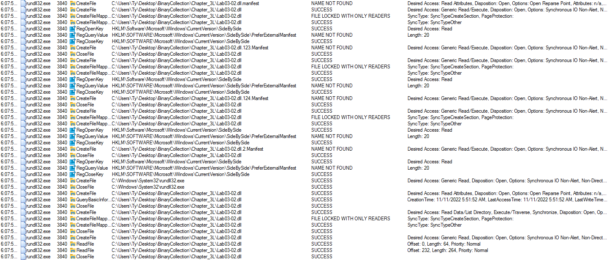
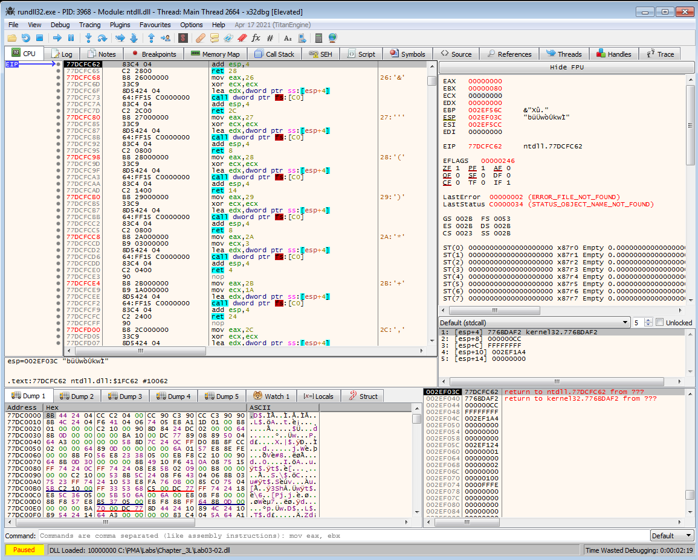

# Lab 3-2 (Unfortunately, Also Broken)

Contents: [Problem](#problem) | [Reversing to Better Understand](#reversing-to-better-understand) | [Summary](#summary)

## Problem

### Analyze the malware found in the file *Lab03-02.dll* using basic dynamic analysis tools.

#### Questions:
    1. How can you get this malware to install itself?
    2. How would you get this malware to run after installation?
    3. How can you find the process under which this malware is running?
    4. Which filter could you set in order to use procmon to glean information?
    5. What are the malware's host-based indicators?
    6. Are there any useful network-based signatures for this malware?

#### Answers:
*Usually before I run anything, I like to poke a bit to see roughly what I can expect to see being run. It just helps me scope my expectations versus outcomes.*

Looking at the **Lab03-02.dll** I see that the export functions are **Install, installA, UninstalService, uninstallA, and ServiceMain**. So I would need to run a CMDline console and call *rundll32.exe* and then call the exported DLL function. I'm going to run this CMD console as Admin just in case. I'll have Procmon open and filtering on **ProcessName = rundll32.exe** just in case (it's noisy but a 30 second capture will suffice).

Unfortunately, the DLL failed to install and execute. Why? Well let's look at Procmon.

I see a lot of *NAME NOT FOUND* and *FILE LOCKED WITH ONLY READERS*. Beyond that I am a bit clueless and a quick search has turned up nothing substanial. Let's try something else.

Okay since the *Install* function did not work, let's try *installA* (I thought **InstallA == installA** in CMD Line, but I guess not hence the retry). Again, it was a fail, so back to the Procmon capture.

Again, see see the same thing of *NAME NOT FOUND* and *FILE LOCKED WITH ONLY READERS*, but that's about it. So, let's do a look with Ghidra/IDA and see what this malware should have done.

In IDA, I clicked on the *Install* export function and was immediately sent to this function. It is interesting that I see **Svchost** (aka Services). Note, **ServiceMain**, **IPRIP**, and **netsvcs** means that the malware is creating a **network service** to conduct either beaconing and C&C.

So we have network requirement and looking at the strings I see interesting URLs. I'm suspecting the *serve.html* is a page we have to hit. I also see what looks like to be User-Agent strings in there with **HTTP/1.1** and **Windows XP 6.11**, but this is a guess.

Looking back at the Imports section shows some interesting calls with **WININET** and **WS2_32** (aka Windows Network DLLs). There are several Internet and HTTP calls as well as some useful information in the imports section with calls like ***gethostname***, ***_strnicp*** (it's above the screenshot crop), ***Sleep***, and ***WaitForSignleObject***. I also see an ***OutputDebugStringA*** which may be helpful in seeing where this DLL fails by using **DbgView** from SysInternals.

Going a little deeper into IDA I see this:

This is just looking at different approaches to fitting the puzzle piece in the correct spot. What I notice here is I see here that there is a registry entry and most likely in *HKLM\SYSTEM\CurrentControlSet\Services* and seeing earlier that *IPRIP* was being added as a service, I am assuming that there will be an *IPRIP* key in the registry. Well, there's not  at this moment because the DLL failed to load/execute. Also, being that it's Windows registry means that persistence is a part of this malware.

So we found out the indicators and signatures, both host and network. Unfortunately it did not run as expected. **Why?** My first guess is the DLL cannot find/create the registry keys it needs to create the service, so it fails hard.

## Reversing to Better Understand

Just because the malware didn't execute doesn't mean just stop there. I personally see this as an opportunity to know more about how Windows Services are created and how they work.

### About Services:
    
Links: 
    
https://learn.microsoft.com/en-us/dotnet/framework/windows-services/introduction-to-windows-service-applications#service-lifetime

https://learn.microsoft.com/en-us/windows/win32/services/debugging-a-service

I'm no expert on Windows Services, so this is a learning experience for me. I do know Windows Services (**svchost.exe**) group items together for security (e.g. Network, RPC, Interfaces, Diagnostics, etc.)

In this malware sample, from what I have obtained so far, is trying to create a Service Group by creating registry keys and run continuously and ultimately hide in plain sight.

### Live Debugging:

Using **x32dbg** (in Admin mode), I need to run the *Lab03-02.dll* with *rundll32.exe*. In order to do that I first need to set the settings for *x32dbg* to **Break on DLL Load** and that is under **Options > Preferences**. *A friend showed me how to do this and it is extremely helpful!*

Then under **File > Change Command Line** make the following edit:

    (Your location will be different...)
    "C:\Windows\System32\rundll32.exe" C:\PMA\Labs\Chapter_3L\Lab03-02.dll, Install 

Now I can step through (F9) twice and break on the loading of *Lab03-02.dll*. Then remove **Break on DLL Load** setting change, since we do not need to break on any other loaded DLLs. Also, take snapshots! Now that we have this in place, the next question is where does it break/fail? I don't intend to spend hours stepping through operations, so on to decomp with Ghidra.

Since the DLL will not install a good starting place is the Install export function which on initial decompilation shows *RegOpenKeyExA*, *OutputDebugStringA*, *RegQueryValueExA*, *CreateServiceA*, etc. We just need to clean up the decompiled code for better reading.

    Note: IDA Pro has some the ability to modify string literals with "const", Ghidra does too with "Set Equate..."
    
    Links:
    https://www.sans.org/blog/a-few-ghidra-tips-for-ida-users-part-2-strings-and-parameters/
    https://swarm.ptsecurity.com/ida-pro-tips/

With **Set Equate** and **Set Associated Label**, we can now turn this:

Into this:

This amount of reversing should be sufficient for now. Back to x32dbg, we can set a breakpoint on the address for the Install function and then step through the dissassembly while referring to the decompliled code in Ghidra/IDA.

## Summary

[...]