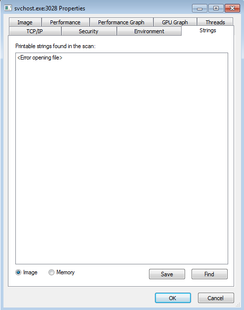

# Lab 3-3 (Unfortunately Also Broken, Too*)

## Execute the malware found in the file *Lab03-03.exe* while monitoring it using basic dynamic analysis tools in a safe environment.

### Questions:
1. What do you notice when monitoring this malware with Process Explorer?
2. Can you identify any live memory modifications?
3. What are the malware's host-based indicators?
4. What is the purpose of this program?

### Answers:

1. Since this is broken on Win 7 the malware sample does not effectively work during execute. In Process Explorer I see **svchost.exe** started as a child process to **Lab03-03.exe**. Hopwever, it fails out and closes by itself. Just by looking at the code in Ghidra, my assumption is this sample is trying to "replace" **svchost.exe** as a process. 
2. Stepping through with x32dbg I can see data being written from .text and .rdata from memory in the created **svchost.exe**. [More here](#in-memory).
3. Viewing the in-memory dump I can see the `practicalmalwareanalysis.log` filename and a series of key presses that are associated with it. [More here](#in-memory).
4. It is a keylogger application, I just cannot execute the malware correctly for the `practicalmalwareanalysis.log` to be created.

## Detailed Answers

### In-Memory

Stepping through the execution at `0x0041251` I eventually see this information being written to the newly created **svchost.exe**. There's a loop starting at `0x00401260` that copies the sections in-memory and writes them to the new process.

 

Note: I ran this a few times so the PIDs do not line up with my screenshots. Here I have a partially stepped through svchost.exe. I am not able to see the strings in the new process either in-memory or in-image. The path, when hoving over the process, states the Access is Denied. If this malware was to run correctly, we would see an orphaned **svchost.exe** process with the in-memory strings as above and this process would look pretty much normal to the regular user.

However, by the time the process is about to resume (and before it crashes just after `0x7630D11` or the `&ZwResumeThread` call) the memory of the process increased in size with different data than what it started with. In short, it's **Process Hollowing**, see below for more information.

### Notable Mentions

It is a bit hard to see this, but pulling a CAPA scan on Lab03-03.exe I see that CAPA recognized the **Process Hollowing** technique (link: https://attack.mitre.org/techniques/T1055/012/).

Also, the original malware sample had decrypted data inside that was decrypted when re-creating the process. You can see this in **CFF Explorer VIII** under **Resource Editor**. Saving this data as RAW to a separate binary you can decrypt this with **010 Editor**. Screenshots below.

Taking the binary data and XORing it by `0x41` decrpyts the binary to readable data. This is the data that is written into the new **svchost.exe** once it is created, suspended, and hollowed.