# IDA Pro (Ghidra too!)

## Lab 5-1

## Analyze the malware found in the file *Lab05-01.dll* using only IDA Pro (or Ghidra). The goal of this lab is to give you hands-on experience with IDA Pro\*.

*I'm actually using IDA Free, not Pro.

### Questions

1. What is the address of `DllMain`?
2. Use the Imports window to browse `gethostbyname`. Where is the import located?
3. How many functions call `gethostbyname`?
4. Focusing on the call to `gethostbyname` located at `0x10001757`, can you figure out which DNS request will be made?
5. How many local variables has IDA Pro recognized for the subroutine at `0x10001656`?
6. How many parameters has IDA Pro recognized for the subroutine at `0x10001656`?
7. Use the Strings window to locate the string `\cmd.exe /c` in the disassembly. Where is it located?
8. What is happening in the area of code that references `\cmd.exe /c`?
9. In the same area, at `0x100101C8`, it looks like `dword_1008E5C4` is a global variable that helps decide which path to take. How does the malware set `dword_1008E5C4`?
10. A few hundred lines into the subroutine at `0x1000FF58`, a series of comparisons use `memcmp` to compare strings. What happens if the string comparison to `robotwork` is successful (when `memcmp` returns 0)?
11. What does the export `PSLIST` do?
12. Use the graph mode to graph the cross-references from `sub_10004E79`. Which API functions could be called by entering this function? Based on the API functions alone, what could you rename this function?
13. How many Windows API functions does `DllMain` call directly? How many at a depth of 2?
14. At `0x10001358`, there is a call to `Sleep`. Looking backward through the code, how long will the program sleep if this code executes?
15. At `0x10001701` is a call to `socket`. What are the three parameters?
16. Using the MSDN page for `socket` and the named symbolic constants functionality in IDA Pro, can you make the parameters more meaningful?
17. Search for usage of the `in` instruction (opcode `0xED`). This instruction is used with a magic string `VMXh` to perform VMware detection. Is that in use in this malware? Using the cross-references to the function that executes the `in` instruction, is there further evidence of VMware detection?
18. Jump your cursor to `0x1001D988`. What do you find?
19. If you have the IDA Python plug-in installed, run *Lab05-01.py*, an IDA Pro Python script provided with the malware fo this book. What happens after you run the script?
20. With the cursor in the same location, how do you turn this data into a single ASCII string?
21. Open the script with a text editor. How does it work?

### Answers

1. `DllMain` is located at `0x1000D02E` in the `.text` section.
2. `gethostbyname` import is located in the `.idata` section at `0x100163C8`.

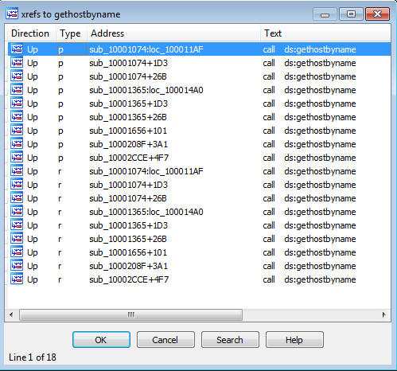 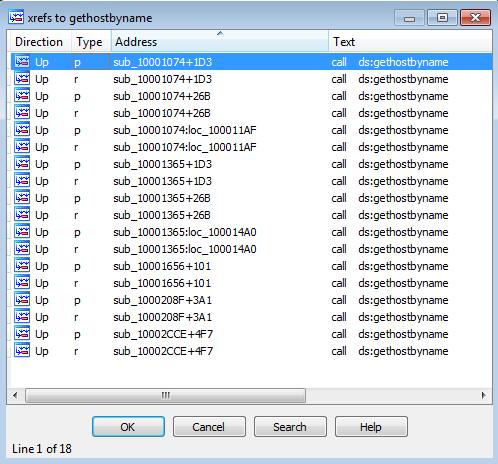
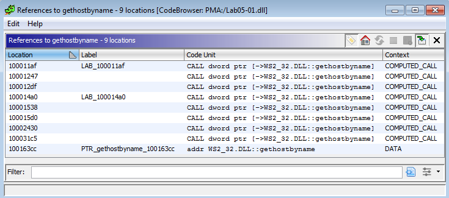

3. There are nine function calls with `gethostbyname` in IDA. After sorting the list, you can see five separate function calls (just count the groupings). Ghidra shows similar data, although it took a couple extra steps to find it. I had to use *Search > Label History (H)* and enter in `gethostbyname`, find the `WS2_32.DLL:gethostbyname` then *right-click >  References > Show References to gethostbyname*.

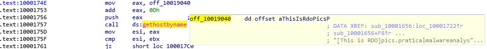

4. Working up from the call to `gethostbyname` we see an offset to `off_100194040`. Clicking into it, in my case hovering over, I see the DNS address of `pics.practicalmalwareanalysis.com` (less the 0xD bytes added in the EAX instruction after, which points to the 'p' in the DNS string).

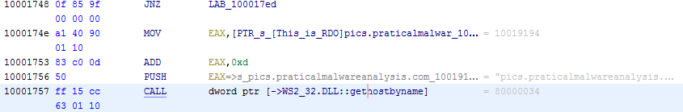

Ghidra is pretty much spelling this out with no effort. Although, it did require a forced disassembly function.

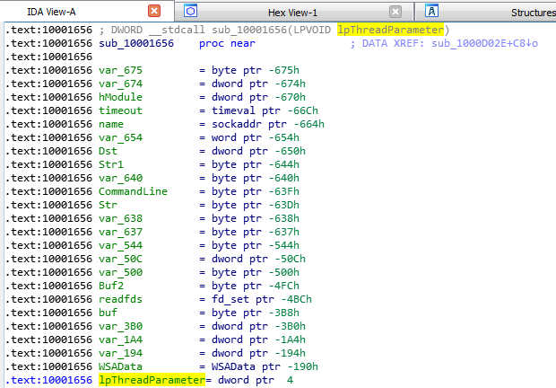

5. There are 23 local variables are recognized.
6. Only one is recognized as an argument parameter. I have it highlighted above.
7. The string is located at `0x10095B34` in the `xdoors_d` section. Ghidra has the same address but a slightly different output for the section.
8. Jumping to `0x100101D0` where `\\cmd.exe /c` is being pushed to on the stack and moving in reverse to `0x1000FF58` we can see what looks to be a shell prompt for remote access with references to current directory (`GetCurrentDirectoryA`), system time structures, and bytes read.

9. Breaking this answer down below.

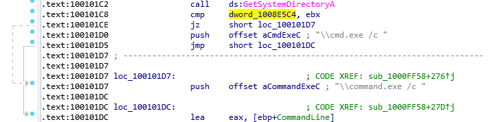

We have the compare to the `dword_1008E5C4` so clicking into that dword we can see the location in the .data section.

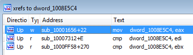

Cross referencing from the .data section we can see the three references using `dword_1008E5C4` in which there was one write and two reads. So we move to the address where the dword is being written to.

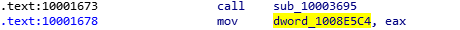

From here we can see that `EAX` is writing data from a previous function call return into `dword_1008E5C4`, so we move one instruction up and look into the call to `sub_10003695`.

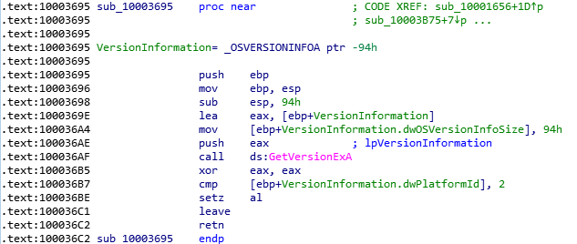

In this function we see a call to `GetVersionExA` that does some enumeration about the OS that queries the `dwOSVersionInfoSize` and `dwPlatformId`. Referencing from (<https://learn.microsoft.com/en-us/windows/win32/api/winnt/ns-winnt-osversioninfoa>) we can see the comparison happening at `0x100036B7` is used to check if the OS version is Windows 2000 or higher. **So in short, `dword_1008E5C4` stores the OS version.**

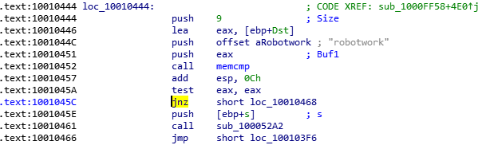

10. At `loc_10010444` we see the string comparison in question. If the string compared string is `robotwork` then the call to `sub_100052A2` is taken. Inside that function, we see registry queries to `SOFTWARE\\Microsoft\\Windows\\CurrentVersion\\WorkTime` and `WorkTimes` keys. From there the results are formatted with `"\r\n\r\n[Robot_WorkTime :] %d\r\n\r\n"` and finally the data is sent over the network socket that was specified earlier at `0x1001045E`.
11. The export PSLIST resolves to `0x10007025` in which a call to function `sub_100036C3` and checks the OS version. Afterwards in either of the paths taken, there are function calls to `CreateToolhelp32Snapshot` in which a process list is obtained and then that data is sent out via a network socket.

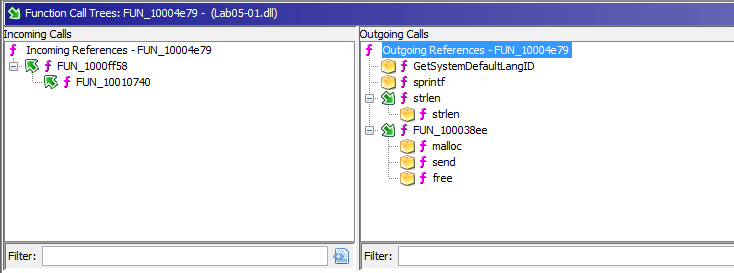

12. Function `sub_10004E79` calls into `GetSystemDefaultLangID`, `sprintf`, `strlen`, `malloc`, `send`, and `free`. I would most likely rename this `_language_localization_ID`.

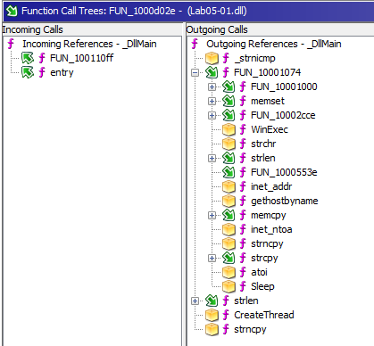

13. Working with Ghidra or IDA Free, there is no specific label called `DllMain`; however, there is `ServiceMain` and  and this could just be a nuance between Ghidra/IDA Free vs IDA Pro. Anyway, the function calls from `DllMain` (I renamed the function myself) are shown here. They go a lot deeper with functions `10003c0d` and `10002cce`.
 
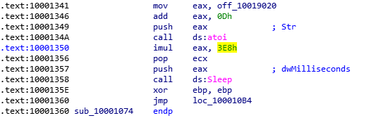
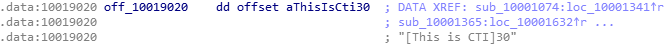

14. At `0x10001358`and working back we'll see `3E8h` which is `1000` in decimal and that number is multiplied by `EAX`. So we have to go up to the offset which is being placed into `EAX` and we see `[This is CTI]30` string. The `0Dh` is the offset of that string which is 30. **30 x 1000 = 30,000 ms or 30 seconds.**

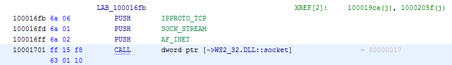

15. Using MSDN Docs for [socket](<https://learn.microsoft.com/en-us/windows/win32/api/winsock2/nf-winsock2-socket>) Ghidra and the *Set Equate* I renamed the socket call stack. `0x6 = IPPROTO_TCP` `0x1 = SOCK_STREAM` and `0x2 = AF_INET`.
16. See the answer above.

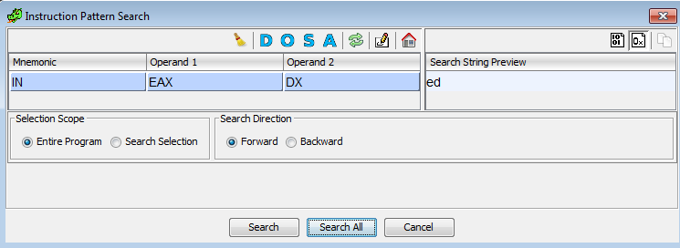

17. Using Ghidra under **Search > For Instruction Patterns** and adding the `ED` bytes manually and selecting the **Hex** under **Input Mode** we can see the resulting mnemonic above.

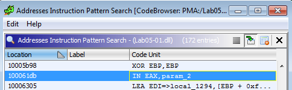

Clicking on **Search All** will return a list of all addresses using that instruction. After converting the hex `0x100061C7` to ASCII we can see the result of `"VMxh"`. Using Cross-References to this function we see there are three calls that have the string `Found Virtual Machine, Install Cancel` after each call.

18. I needed to use Ghidra's disassembly function here to make sense of the instructions here (IDA Free was not helpful in this case). The decompilation seemed a bit over my head and requires a bit more digging into. See attached [CAPA Output](CAPAoutput.txt)

19. Unable to do.
20. Unable to do.
21. Unable to do.
