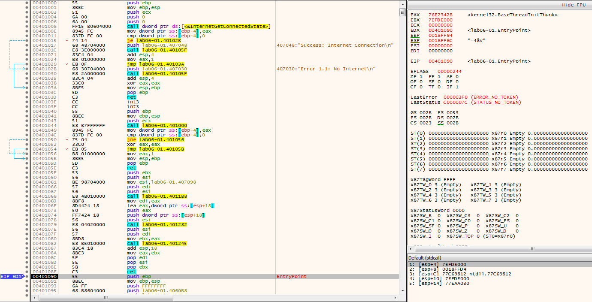
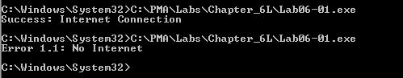

# Lab 6-1

## Analyze the malware found in the *Lab06-01.exe*

### Questions

1. What is the major code construct found in the only subroutine called by `main`?
2. What is the subroutine located at `0x40105F`?
3. What is the purpose of this program?

### Answers

1. Starting off, the entry point in *Lab 6-1* is not `main`, it is a function of `main`. So we need to work back up to `main`, which in this case was just scrolling up to `0x401040` which is right below some useful strings at `0x401017` and `0x40102b`, which we will see in the [Dynamic Analysis](#dynamic-analysis) below. The code construct found at `0x401000` is an `if` statement based off the return from `InternetGetConnectedState` which is only checking for a network adapter status and not a connection to the open Internet. [Here](Images/6-1-3.png) is a graph view of that `if` statement in the sample.

2. It's a `printf` call, based on the information that was being pushed on to the stack before the call and the reference point from previous [Dynamic Analysis](#dynamic-analysis).

3. This program checks for a network connection. Again not a live Internet connection, but a network connection based off the network adapter status.

----

### Detailed Answers

#### Static Analysis

Opening this sample in CFF Explorer VIII, detect it easy, and [CAPA](CAPA.txt) showed some useful information like the strings and tactics/behaviors; along with the import of `WININET.dll` ([MSDN link](<https://learn.microsoft.com/en-us/windows/win32/wininet/about-wininet>)).

#### Dynamic Analysis

Running the sample first with a network connection to VMnet0 (isolated network) showed the string of `Success: Internet Connection` but when I disconnected that adapter then I received the `Error 1.1: No Internet`. Beyond that there was no immediate functionality. Nothing shown in Process Explorer.
