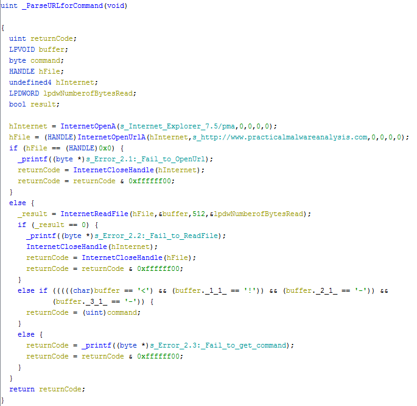

# Lab 6-2

## Analyze the malware found in the *Lab06-02.exe*

### Questions

1. What operation does the first subroutine called by `main` perform?
2. What is the subroutine located at `0x40117F`?
3. What does the second subroutine called by `main` do?
4. What type of code construct is used in this subroutine?
5. Are there any network-based indicators for this program?
6. What is the purpose of this malware?

### Answers

1. It is the same function as in [Lab 6-1](/Chap6/6-1/README.md#answers) that checks for an Internet connection. There's some additional messages attached based on the success of having Internet access. Further analysis [below](#detailed-answers).
2. Same as Lab 6-1, in which `0x40117F` is a printf function.
3. The second subroutine is `0x401040` and that is the path if an Internet connection is found. Inside this function, an Internet connection is created with `InternetOpenA` then a URL (`http://www.practicalmalwareanalysis.com/cc.htm`) is called using `InternetOpenUrlA` and is downloaded, read (`InternetReadFile`), and parsed into a Buffer starting at the `<!--` comment section in an HTML file. If anything fails in this process, the function returns with an error code.
4. The code construct used here is a char array filled from a buffer that is read and parsed one byte at a time with the data from `InternetReadFile`.
5. The UserAgent string of `Internet Explorer 7.5/pma` and the URL of `http://www.practicalmalwareanalysis.com/cc.htm`.
6. As addressed before, this malware checks for an Internet connection, scrapes a comment section of a HTML file at a specific URL and then parses the command. Using FakeNet-NG, I was able to fiddle with the custom response.

## Detailed Answers

### Static Analysis

This is exactly similar to the [Lab 6-1](/Chap6/6-1/README.md#static-analysis) sample in terms of file attributes with Imports. The [CAPA](CAPA.txt) analysis showed some additional Command and Control behaviors.

### Dynamic Analysis

Running this malware dynamically was a lot more engaging, especially after the [advanced static analysis](#advanced-static-analysis). I tried to hit all errors possible using FakeNet-NG. I need to work deeper into the disassembly to find out how the parsed command is being read and how it is printed out.

### Advanced Static Analysis

Digging into the function at `0x401040` we can see how the malware is polling a HTML page for its commands. As stated above, the malware requests a URL then reads and parses the comment section of the requested webpage. Then the malware then sleeps.
