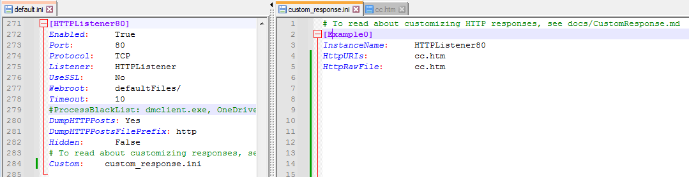
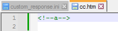
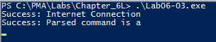
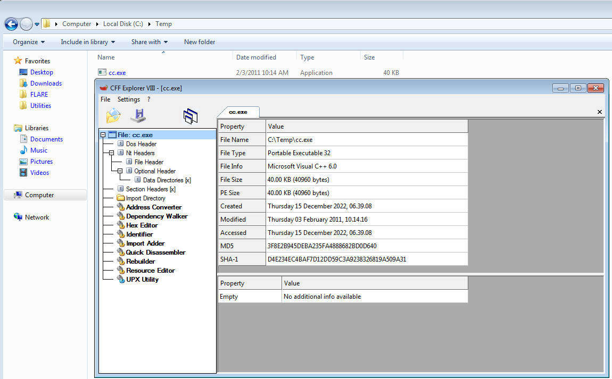
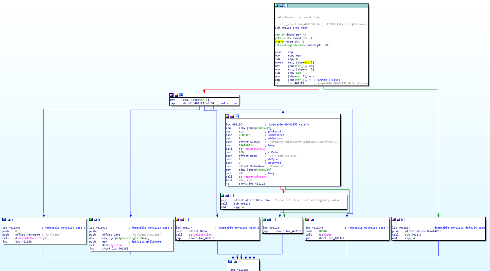
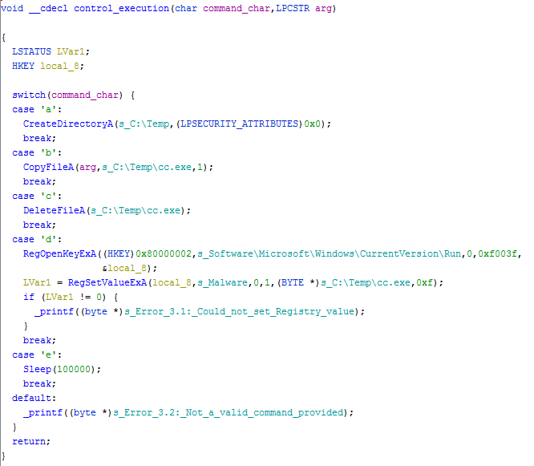

# Lab 6-3

## Analyze the malware found in the *Lab06-03.exe*

### Questions

1. Compare the calls in `main` to Lab 6-2's `main` method. What is the new function called from `main`?
2. What parameters does this new function take?
3. What major code construct does this function contain?
4. What can this function do?
5. Are there any host-based indicators for this malware?
6. What is the purpose of this malware?

### Answers

1. The calls in Lab 6-3 are similar to [Lab 6-2](/Chap6/6-2/README.md#answers), except the new function that is called is `0x401130`. This new function is what processes the commands from the HTML comment section in `http://www.praticalmalwareanalysis.com/cc.htm`.
2. This function takes two parameters. The first parameter is a character that comes from the HTML comment which is used in the switch statement of that function. The second parameter is the `arg_0` program name which is used in the second case of the switch jumptable.
3. The major code construct is a switch statement that executes five different actions based on the command received.
4. This function can create a new directory, can copy and delete a file, open a registry and set a value, sleep for 100 seconds, or print error messages.
5. The host-based indicators are the file and directory names and the attributes of the registry key.
6. Building off of Labs 6-1 and 6-2, this malware has the additional purpose of using the value set in the HTML comment section and execute a command based on the path of the switch jumptable.

## Detail Answers

### Static Analysis

This is exactly similar to the [Lab 6-1](/Chap6/6-1/README.md#static-analysis) and [Lab 6-2](/Chap6/6-2/README.md#static-analysis) sample in terms of file attributes with Imports. The [CAPA](CAPA.txt) analysis showed some additional Command and Control behaviors as well as file and registry manipulation abilities. The strings also show some additional error messages from the previous labs.

### Dynamic Analysis

Building off of what I did in 6-2, I tweaked the [**FakeNet-NG**](<https://www.mandiant.com/resources/blog/fakenet-ng-next-gen>) config to use a custom response which in turn hosted the `cc.htm` HTML file that had the `<!--a-->` HTML comment in it. When I would execute the malware sample, the malware would indeed create a `C:\Temp\` directory. To change the command execution and explore the other paths all I would need to do is edit the character in the HTML comment tag and save the file, then restart **FakeNet-NG** and execute the malware.

Here I had the malware create the `cc.exe` file and then copies the malware code into that executable, essentially replicating itself.

### Advanced Static Analysis

Pulling up Lab 6-3 in IDA we can see the graphical layout of the switch jumptable and the alternate paths in which the malware can execute based on the command received.

Using Ghidra, I was able to decompile the same function to for easy reading. Ghidra, auto-completed the cases statements when I changes the first parameter in the `control_execution` function to `char`. The strings had to be cleaned up a bit in Ghidra, but only for clarity.
