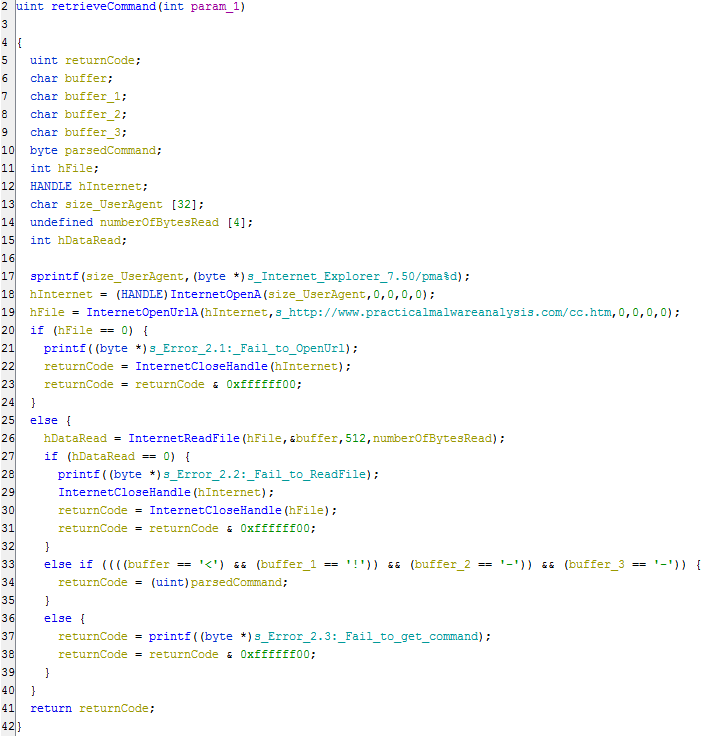

# Lab 6-4

## Analyze the malware found in the *Lab06-04.exe*

### Questions

1. What is the difference between the calls made from `main` method in Labs 6-3 and 6-4?
2. What new code construct has been added to `main`?
3. What is the difference between this lab's parse HTML function and those of the previous labs?
4. How long will this program run? (Assume that it's connected to the Internet.)
5. Are there any new network-based indicators for this malware?
6. What is the purpose of this malware?

### Answers

1. I don't see much of a difference between the two Labs other than the fact that inside `0x401040` where the malware is retrieving the command from the HTML comment, the UserAgent string appears to be dynamically generated with the `Internet Explorer 7.50/pma%d` string. Although, I do not see the digit pop up in FakeNet-NG.
2. There is a for loop and a sleep function added. See `0x401230`.
3. `0x401040` takes a parameter now and the UserAgent prints with an sprintf function with the use of the charBuffer. Although, decompilation with Ghidra does not show the parameter being used (it's probably a Ghidra thing). I'll show this in [Advanced Static Analysis](#advanced-static-analysis).
4. This program will run 1440 minuets.
5. Yes. Starting at `0x401052`tThere is a dynamic User-Agent string which is `"Internet Explorer 7.50/pma%d"` with the `%d` the current looping count.
6. This malware sample checks for an active Internet connection (if none, then it fails). Then the program connects to a URL and uses a User Agent string to download a webpage (HTML comment within that page). That comment is parsed for a command that is then used to execute a jump table to execute a few specific actions such as creating a directory, copying a file, deleting a file, opening and modifying a registry key, or sleeping. The malware will run for 24 hours before exiting.

## Detailed Answers

### Static Analysis

This is exactly similar to the previous labs sample in terms of file attributes with Imports. The [CAPA](CAPA.txt) analysis showed the same attributes as [Lab 6-3](/Chap6/6-3/README.md).

### Dynamic Analysis

The basic functionality is similar to [Lab 6-3](/Chap6/6-3/README.md); however, we can see the modified directory file

 

This is what FakeNet-NG shows with the dynamic User Agent string.

I had the malware create the `cc.exe` to show that it indeed worked. The `cc.exe.viv` is just an analysis of the `cc.exe` file which is indeed a copy of the malware itself. Unfortunately, once the file is created/copied, the malware quits. The only time I have had the malware continue to run is when it is deleting the file.

It will continue to run with `case d` (creating the Registry Key) in the switch table; however, the key will not be created.

### Advanced Static Analysis

Here we have the detailed decompiled view of the HTML webpage comment that is being downloaded and parsed. Comparing it to [Lab 6-3](/Chap6/6-3/README.md) we can see the dynamic User Agent String.

When the command is parsed it is then passed into this switch table which we can see the different actions this malware can take such as Create a Directory, Copy a File, Delete a File, Modifying a Registry Key, or Sleeping.

Referring to question 4, here is the screenshot of the execution counter loop that keeps this malware running for 1440 minuets (24 hours).
