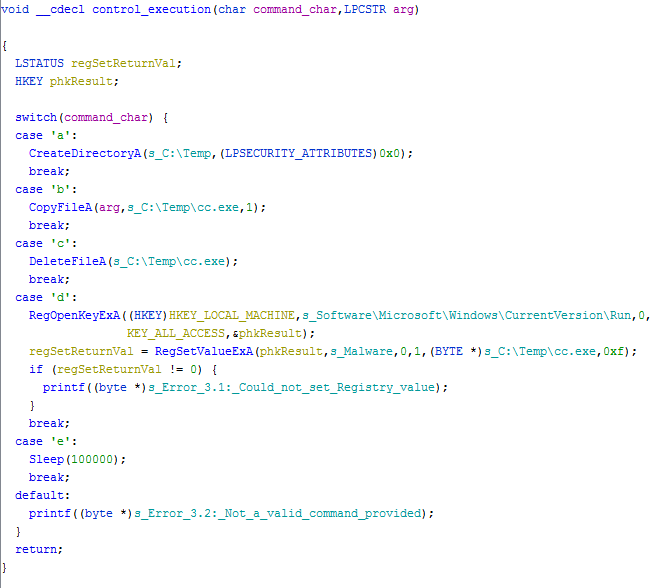

# Lab 6-4

## Analyze the malware found in the *Lab06-04.exe*

### Questions

1. What is the difference between the calls made from `main` method in Labs 6-3 and 6-4?
2. What new code construct has been added to `main`?
3. What is the difference between this lab's parse HTML function and those of the previous labs?
4. How long will this program run? (Assume that it's connected to the Internet.)
5. Are there any new network-based indicators for this malware?
6. What is the purpose of this malware?

### Answers

1. I don't see much of a difference between the two Labs other than the fact that inside `0x401040` where the malware is retrieving the command from the HTML comment, the UserAgent string appears to be dynamically generated with the `Internet Explorer 7.50/pma%d` string. Although, I do not see the digit pop up in FakeNet-NG.
2. There is a for loop and a sleep function added. See `0x401230`.
3. `0x401040` takes a parameter now and the UserAgent prints with an sprintf function with the use of the charBuffer. Although, decompilation with Ghidra does not show the parameter being used (it's probably a Ghidra thing). I'll show this in [Advanced Static Analysis](#advanced-static-analysis).

## Detail Answers

### Static Analysis

This is exactly similar to the previous labs sample in terms of file attributes with Imports. The [CAPA](CAPA.txt) analysis showed the same attributes as [Lab 6-3](/Chap6/6-3/README.md). 

### Dynamic Analysis

### Advanced Static Analysis

