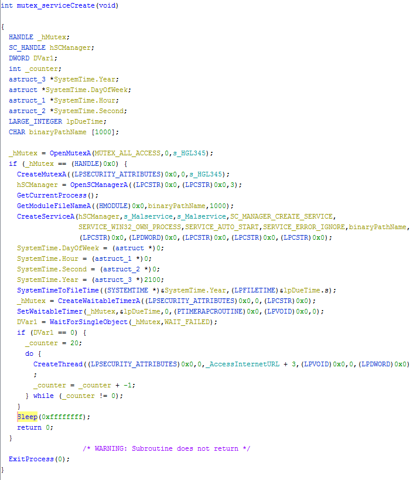
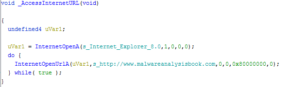

# Lab 7-1

## Analyze the malware found in the *Lab07-01.exe*

### Questions

1. How does this program ensure that is continues running (achieves persistence) when the computer is restarted?
2. Why does this program use a mutex?
3. What is a good host-based signature to use for detecting this program?
4. What is a good network-based signature for detecting this malware?
5. What is the purpose of this program?
6. When will this program finish executing?

### Answers

1. I see immediately int the strings the value of `MalService` and `Malservice` as well as `CreativeServiceA`, `OpenSCManagerA`, `StartServiceCtrlDispatcherA` so my initial guess is that persistence is achieved through the creation of a Windows Service.
2. The use of a mutex here would be to make sure the malware only has one version of itself running on the machine.
3. A great host-name signature would be the Windows Service name of `MalService1` that are registered during creation and most likely the [`CreateMutexA`](https://learn.microsoft.com/en-us/windows/win32/api/synchapi/nf-synchapi-createmutexa) function call along with the mutex name of `HGL345`. I had to open Ghidra to find where `HGL345` is used in order to verify it was indeed a hard coded signature. The use is at `0x401052`.
4. Looking at the strings from *Detect It Easy* I see the URL string for `http://www.malwareanalysisbook.com` as well as `Internet Explorer 8.0` as User Agent. I also see `InternetOpenUrlA` and `InternetOpenA`.
5. The purpose of this program is to create a service, but with itself as the only copy on the machine and is persistent through that service. From there the malware connects to a URL `https://www.malwareanalysisbook.com` on 1 January, 2100. Due to the Do/While Loop and no receiving of Internet traffic back to the application. It also creates 20 threads at one time. I'm guessing that this is meant to me a DDoS application for the URL above.
6. No. I see no evidence of a termination function.

## Detailed Answers

### Static Analysis

The [CAPA](CAPA.txt) analysis which notices the persistence as a service and the mutex ability.

### Dynamic Analysis

FakeNet-NG picked up the DNS Server request for `www.malwareanalysisbook.com` and I see the `Lab07-01.exe` processes in ProcessExplorer. Although I am not seeing the `MalwareService` or the `HGL345` mutex show up at all. In Regshot I see the strings being added to the Registry in ROT13. So, `P:\CZN\Ynof\Puncgre_7Y\Yno07-01.rkr` is `C:\PMA\Labs\Chapter_7L\Lab07-01.exe`. I'm not sure what is going on with this, could be a Win 7 issue.

### Advanced Static Analysis

Decompiling the mutex/service create function we can see the Windows API calls being used here. I had to do some autostruct creation with the `SystemTime` in Ghidra because I did not know a better way to label them. We can also see the `CreateThread` call with the `_AccessInternetURL` argument which I decompiled manually.

This is the manual decompilation of the `_AccessInternetURL` function. The main focus here would be the infinite Do/While Loop which calls out to the `http://www.malwareanalysisbook.com` address.
