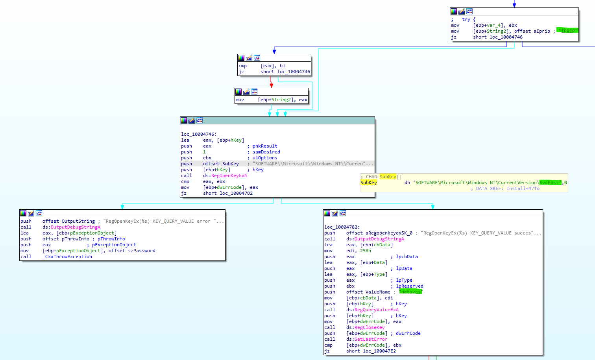
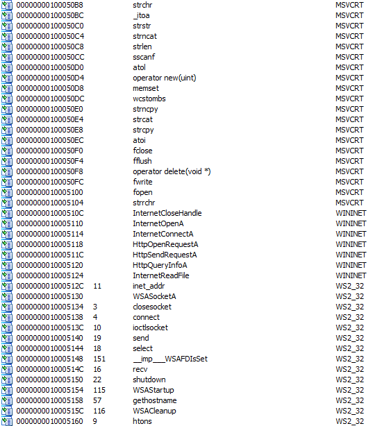

# Lab 3-2 (Unfortunately Also Broken)

## Analyze the malware found in the file *Lab03-2.dll* using basic dynamic analysis tools.

### Questions:
    1. How can you get this malware to install itself?
    2. How would you get this malware to run after installation?
    3. How can you find the process under which this malware is running?
    4. Which filter could you set in order to use procmon to glean information?
    5. What are the malware's host-based indicators?
    6. Are there any useful network-based signatures for this malware?

### Answers:
*Usually before I run anything, I like to poke a bit to see roughly what I can expect to see being run. It just helps me scope my expectations versus outcomes.*

Looking at the **Lab03-02.dll** I see that the export functions are **Install, installA, UninstalService, uninstallA, and ServiceMain**. So I would need to run a CMDline console and call *rundll32.exe* and then call the exported DLL function. I'm going to run this CMD console as Admin just in case. I'll have Procmon open and filtering on **ProcessName = rundll32.exe** just in case (it's noisy but a 30 second capture will suffice).

Unfortunately, the DLL failed to install. Why? Well let's look at Procmon.

I see a lot of *NAME NOT FOUND* and *FILE LOCKED WITH ONLY READERS*. Beyond that I am a bit clueless and a quick search has turned up nothing substanial. Let's try something else.

Okay since the *Install* function did not work, let's try *installA* (I thought **InstallA == installA** in CMD Line, but I guess not hence the retry). Again, it was a fail, so back to the Procmon capture.

Again, see see the same thing of *NAME NOT FOUND* and *FILE LOCKED WITH ONLY READERS*, but that's about it. So, let's do a look with Ghidra/IDA and see what this malware should have done.

In IDA, I clicked on the *Install* export function and was immediately sent to this function. It is interesting that I see **Svchost** (aka Services) and **IPRIP** which a basic search returned this (https://www.windows-security.org/windows-service/rip-listener). Oh and **netsvcs** too, so this is means **network**... 

So we have network requirement and looking at the strings I see interesting URLs. I'm suspecting the *serve.html* is a page we have to hit. I also see what looks like to be User-Agent strings in there with **HTTP/1.1** and **Windows XP 6.11**, but this is a guess.

Looking back at the Imports section shows some interesting calls with **WININET** and **WS2_32** (aka Windows Network DLLs).
Going a little deeper into IDA I see this:

This is just looking at different approaches to fitting the puzzle piece in the correct spot. What I notice here is I see here that there is a registry entry and most likely in *HKLM\SYSTEM\CurrentControlSet\Services* and seeing earlier that *IRIP* was being added as a service, I am assuming that there will be an *IRIP* key in the registry. Well, there's not because the DLL failed to load/execute. Also, being that it's Windows registry means that persistence is a part of this malware.

So we found out the indicators and signatures, both host and network. Unfortunately it did not run as expected. Why? I'm not sure yet.